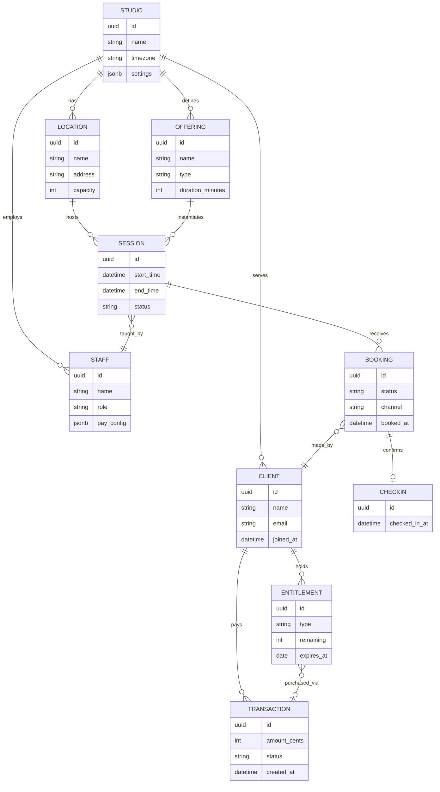
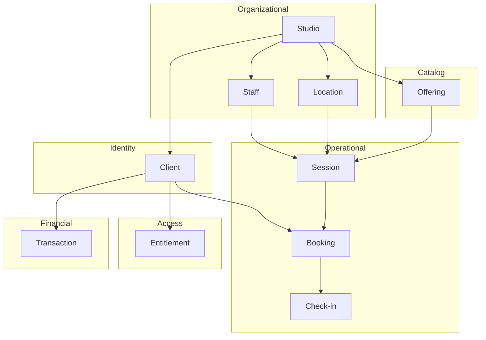
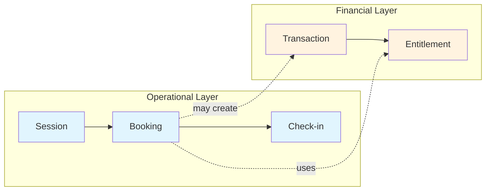
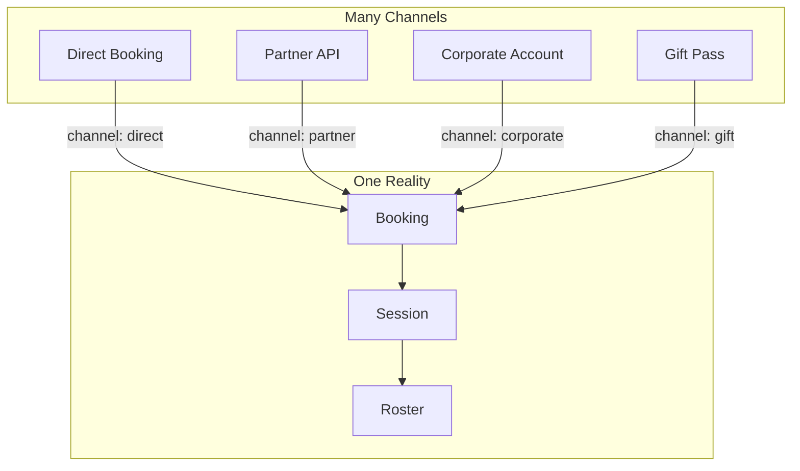

# Domain Model

Visual reference for Tandava's core entities and relationships.

> For narrative explanation, see [architecture/DOMAIN_MODEL.md](../architecture/DOMAIN_MODEL.md)

---

## Core Principle

```
┌─────────────────────────────────────────────────────────────┐
│  This system models universal studio reality.               │
│  Every entity corresponds to something physically real.     │
│  Software abstractions that exist only in code are avoided. │
└─────────────────────────────────────────────────────────────┘
```

---

## Entity Relationship Diagram



---

## Entity Responsibilities



---

## Key Separations

These entities are intentionally distinct:

| Concept A | Concept B | Why Separate |
|-----------|-----------|--------------|
| **Offering** | **Session** | Template vs. instance. "Vinyasa Flow" vs. "Vinyasa Flow on Tuesday at 9am" |
| **Booking** | **Check-in** | Intent vs. actuality. Reserved ≠ attended |
| **Booking** | **Transaction** | Operational fact vs. financial settlement |
| **Entitlement** | **Transaction** | Permission vs. payment. Access can exist without purchase |
| **Session** | **Transaction** | Classes happen regardless of payment status |



---

## Channel as Metadata

Bookings can originate from multiple sources. The channel is **metadata**, not a separate system.



**Key insight:** There is one schedule, one roster, one attendance record. Channels annotate how the booking arrived—they do not fork reality.

---

## Tandava Terminology Mapping

| Concept | Tandava Schema | Notes |
|---------|----------------|-------|
| Studio | `studios` | Root organizational entity |
| Location | `locations` | Physical or virtual venue |
| Offering | `classes` | Reusable class/workshop template |
| Session | `class_occurrences` | Scheduled instance |
| Booking | `bookings` | Reservation record |
| Check-in | `check_ins` | Attendance confirmation |
| Client | `member_profiles` | Person who attends |
| Staff | `staff_profiles` | Person who works/teaches |
| Entitlement | `memberships`, `class_packs` | Access permissions |
| Transaction | `transactions` | Financial settlement |

---

## Related Documentation

- [DOMAIN_MODEL.md](../architecture/DOMAIN_MODEL.md) — Narrative explanation
- [ROLE_ACCESS_CONTROL.md](../architecture/ROLE_ACCESS_CONTROL.md) — Who sees what
- [02-architecture.md](02-architecture.md) — System layers
