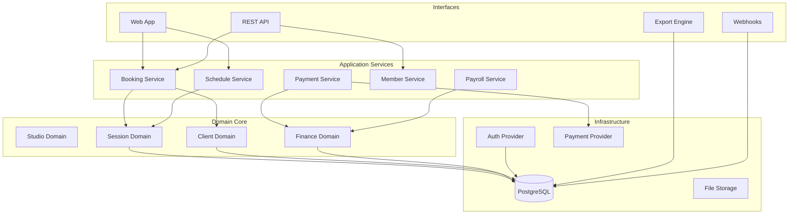
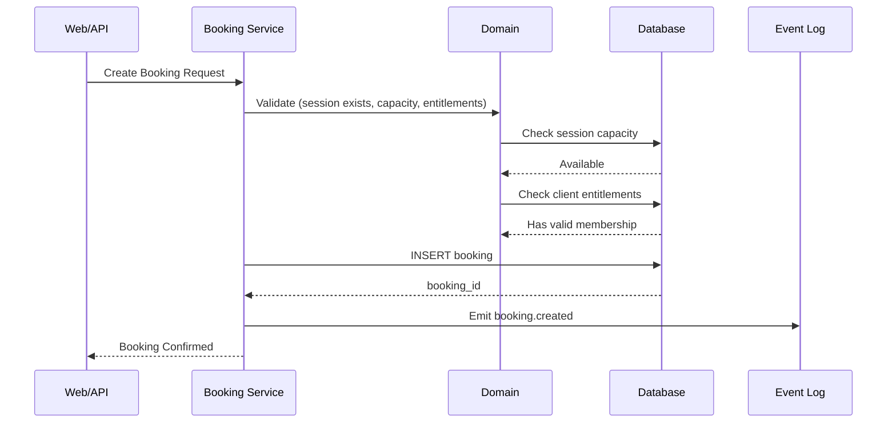
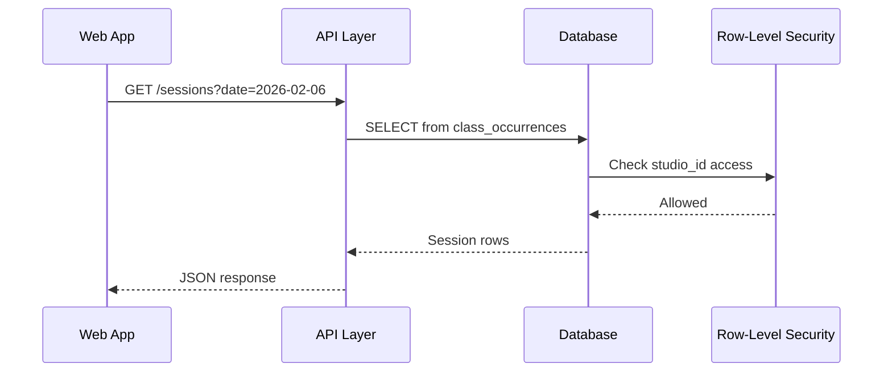
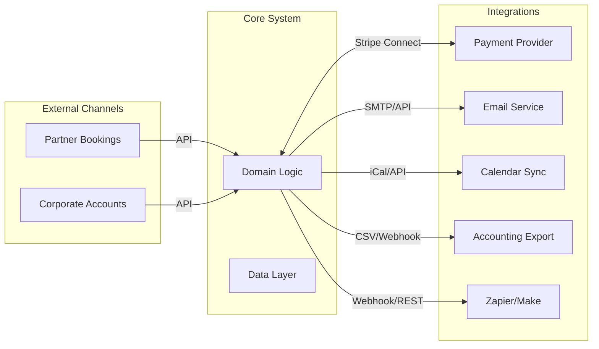
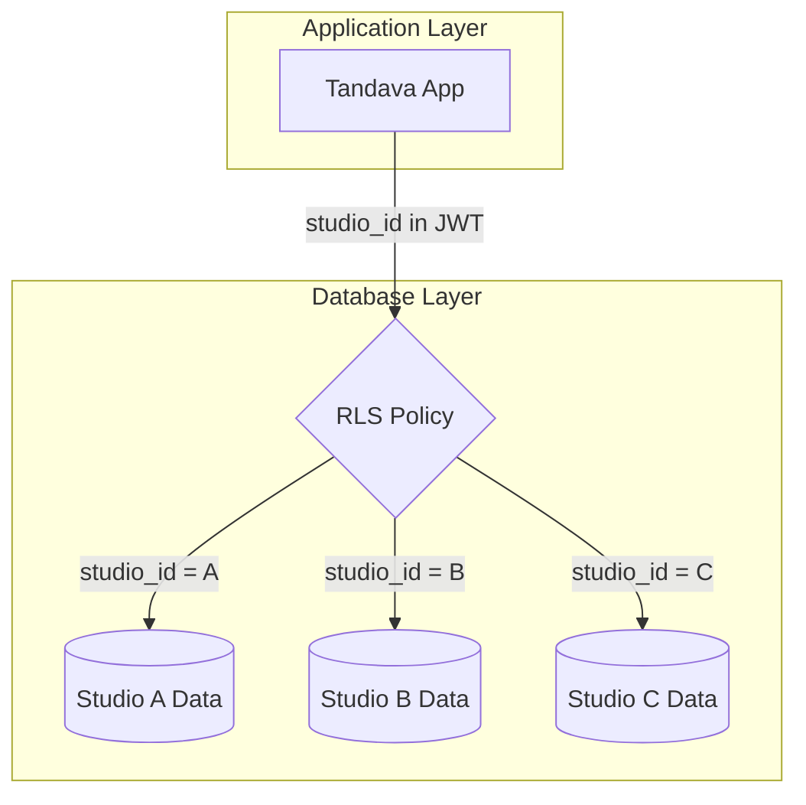
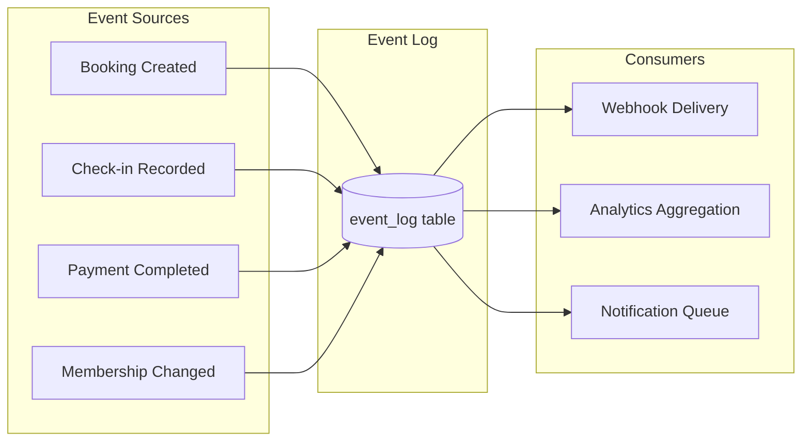

# System Architecture

High-level structure and data flow.

---

## Logical Layers

---

## Data Flow: Write Path

When a booking is created:

---

## Data Flow: Read Path

When rendering a schedule:

---

## Boundaries

**Key principle:** The core system is self-contained. Integrations are satellites that connect via well-defined interfaces.

---

## Multi-Tenancy

Each studio is isolated at the database level via Row-Level Security (RLS).

- Every table has a `studio_id` column
- RLS policies enforce: `studio_id = auth.jwt()->>'studio_id'`
- Cross-studio data access is impossible at the database level

---

## Event Architecture

The system emits events for significant operations:

Events are:
- Stored durably in `event_log`
- Delivered via configurable webhooks
- Used for analytics aggregation
- Triggerable by automation platforms

---

## Technology Stack

| Layer | Technology | Purpose |
|-------|------------|---------|
| Frontend | React + TypeScript | Web application |
| UI Components | shadcn/ui + Tailwind | Accessible, themeable UI |
| Backend | Supabase | Database, Auth, Storage, Realtime |
| Database | PostgreSQL | Relational data with RLS |
| Payments | Stripe Connect | Multi-tenant payment processing |
| Hosting | Any static host | Vercel, Netlify, Cloudflare, self-hosted |

---

## Related Documentation

- [01-domain-model.md](01-domain-model.md) — Entity relationships
- [03-key-flows.md](03-key-flows.md) — Operational flows
- [04-integrations.md](04-integrations.md) — Integration architecture
