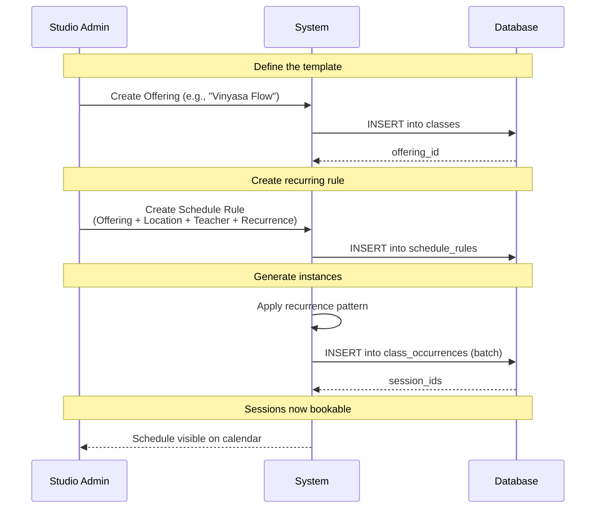
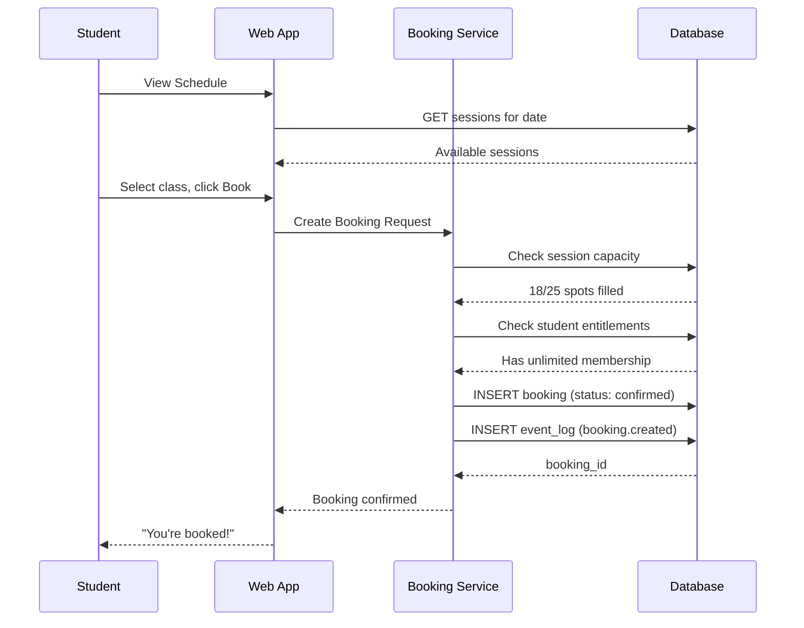
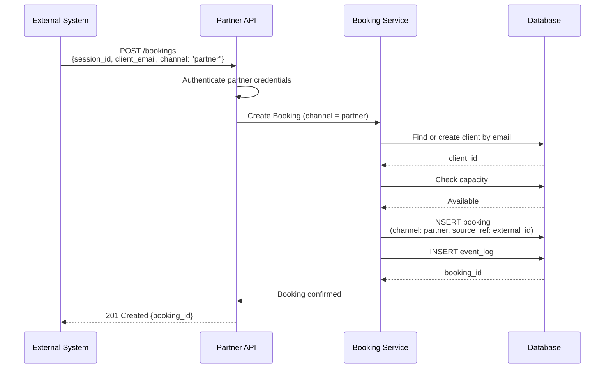
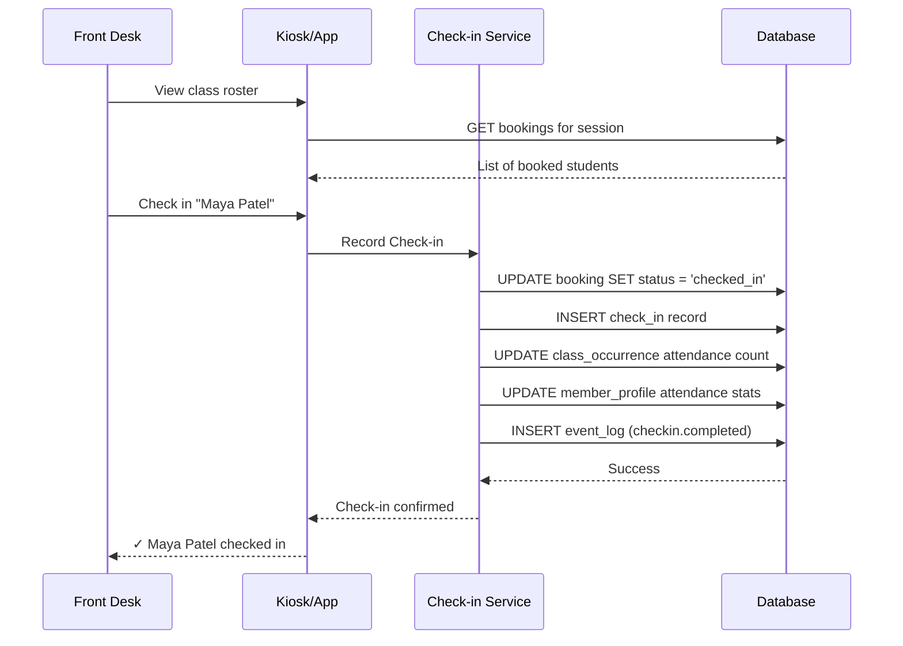
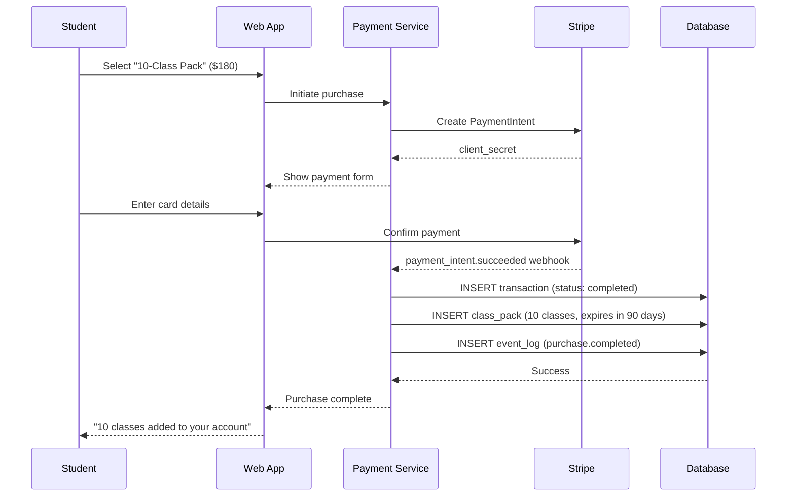
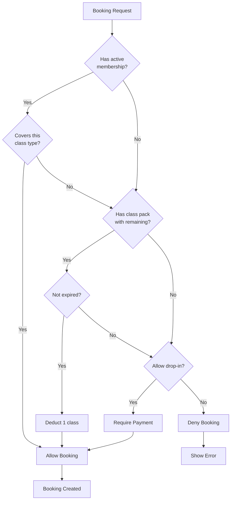
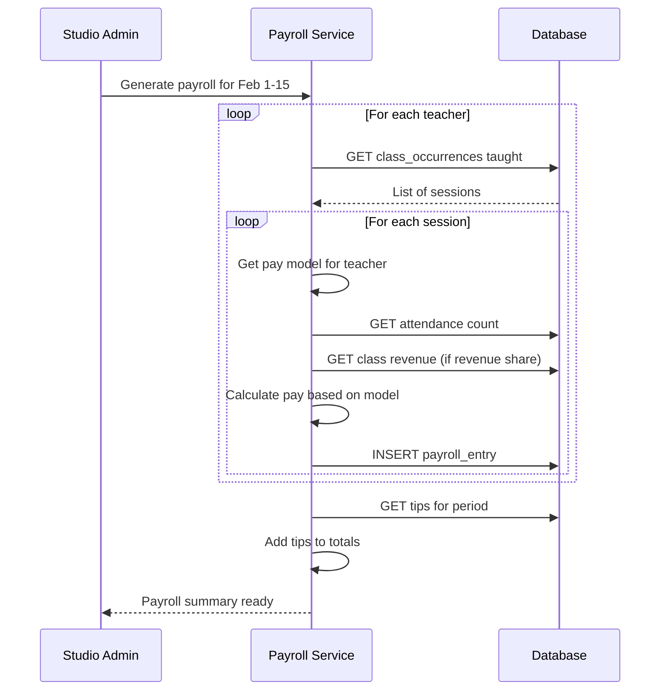
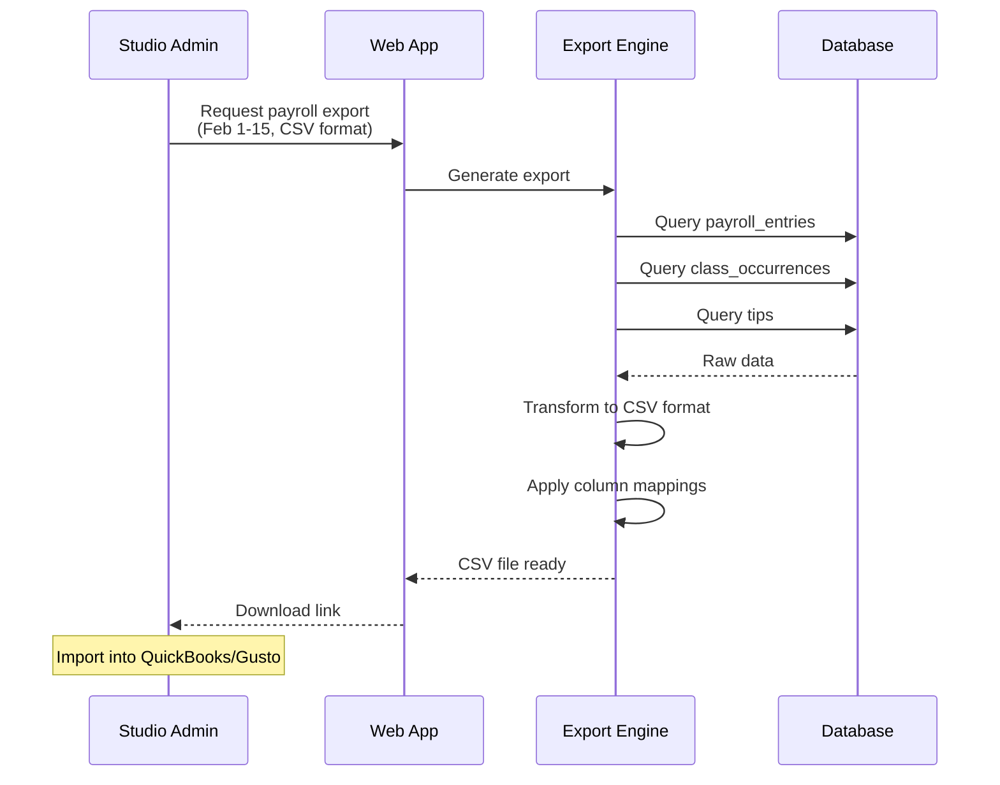
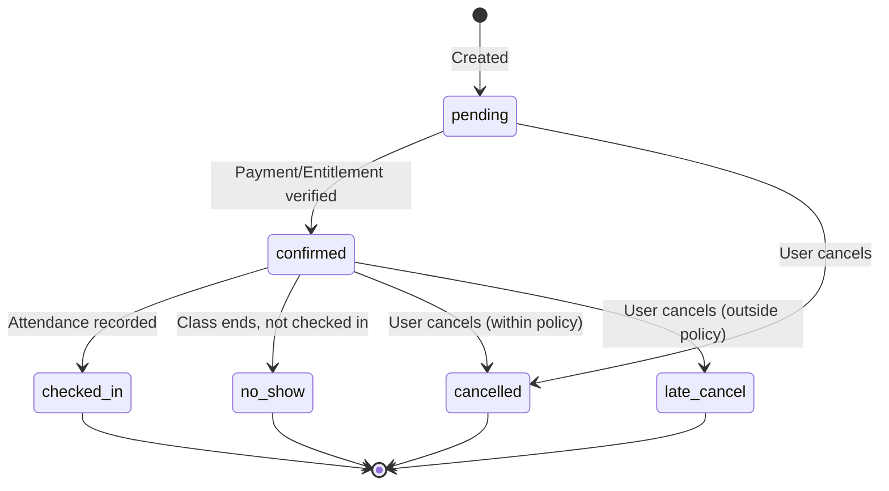
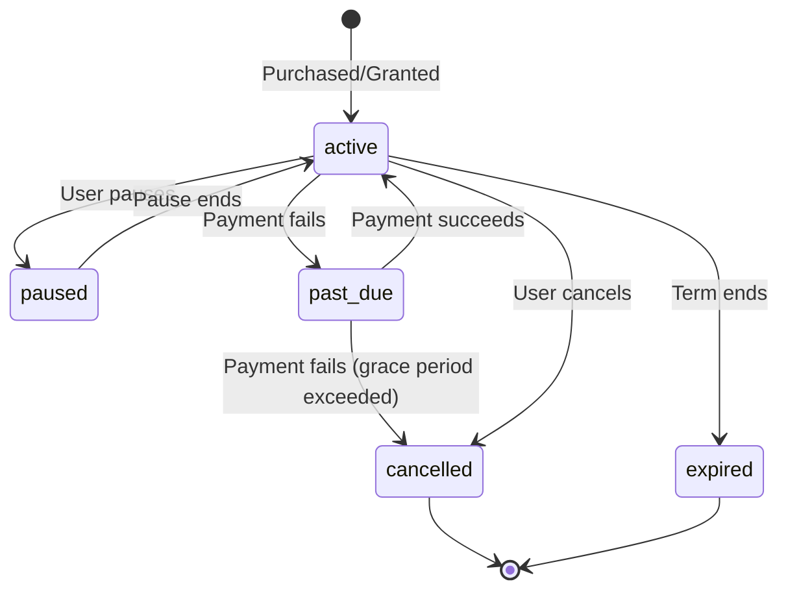

# Key Flows

Visual walkthroughs of core system operations.

---

## 1. Schedule Creation

How a class gets from concept to bookable session.

**Key concepts:**
- **Offering** = what can happen
- **Schedule Rule** = when it repeats
- **Session (class_occurrence)** = specific instance

---

## 2. Direct Booking Flow

Student books a class through the app.

---

## 3. Partner/Channel Booking Flow

Booking arrives from external source (e.g., corporate account, partner API).

**Key insight:** Same booking table, same roster, same session. Channel is metadata.

---

## 4. Check-in Flow

Recording attendance when student arrives.

---

## 5. Payment Flow

Purchase that grants entitlement.

---

## 6. Entitlement Check (During Booking)

How the system determines if a student can book.

---

## 7. Payroll Calculation Flow

How teacher pay is calculated.

---

## 8. Export Flow

Generating data for external systems.

---

## State Transitions

### Booking Status

### Membership Status

---

## Related Documentation

- [01-domain-model.md](01-domain-model.md) — Entity definitions
- [02-architecture.md](02-architecture.md) — System structure
- [05-scenarios.md](05-scenarios.md) — End-to-end scenarios
