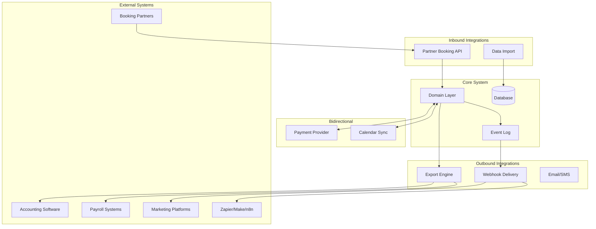
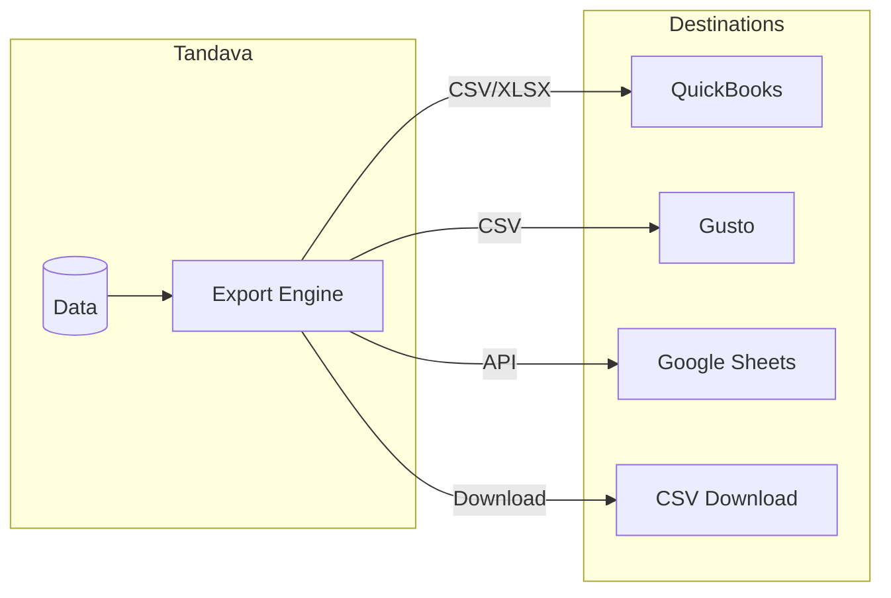
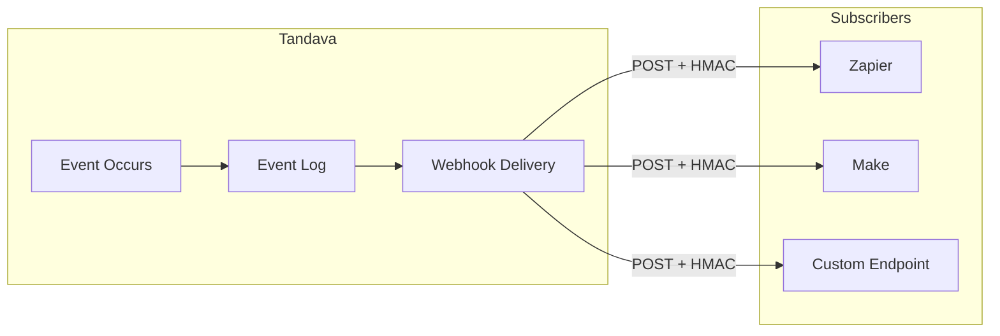
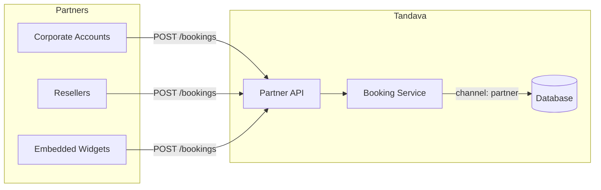
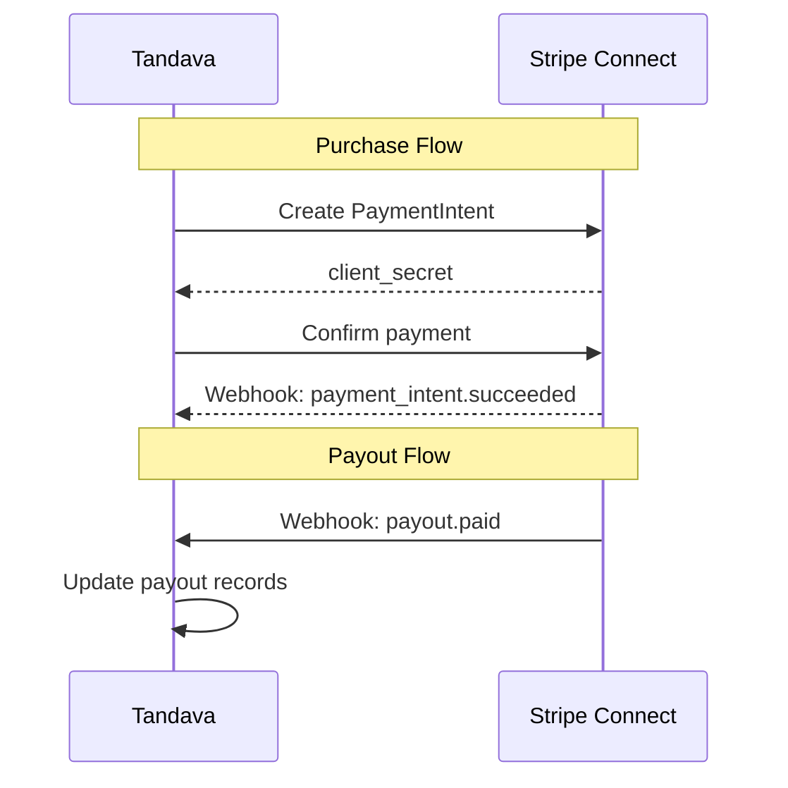
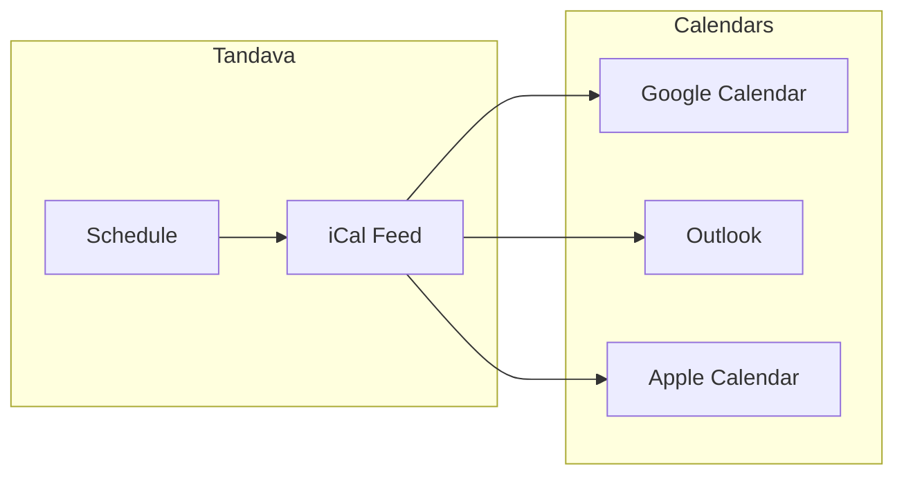
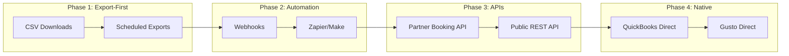
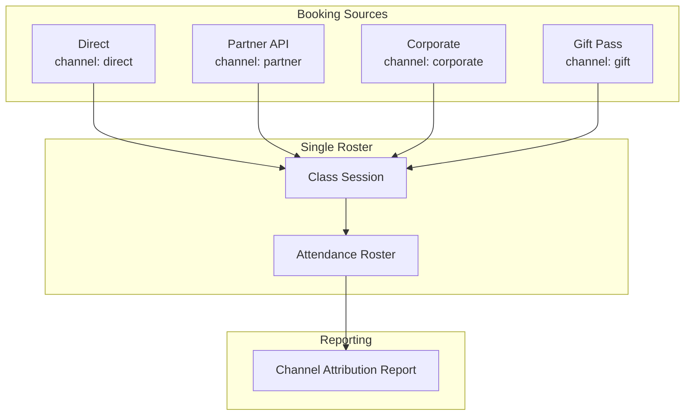
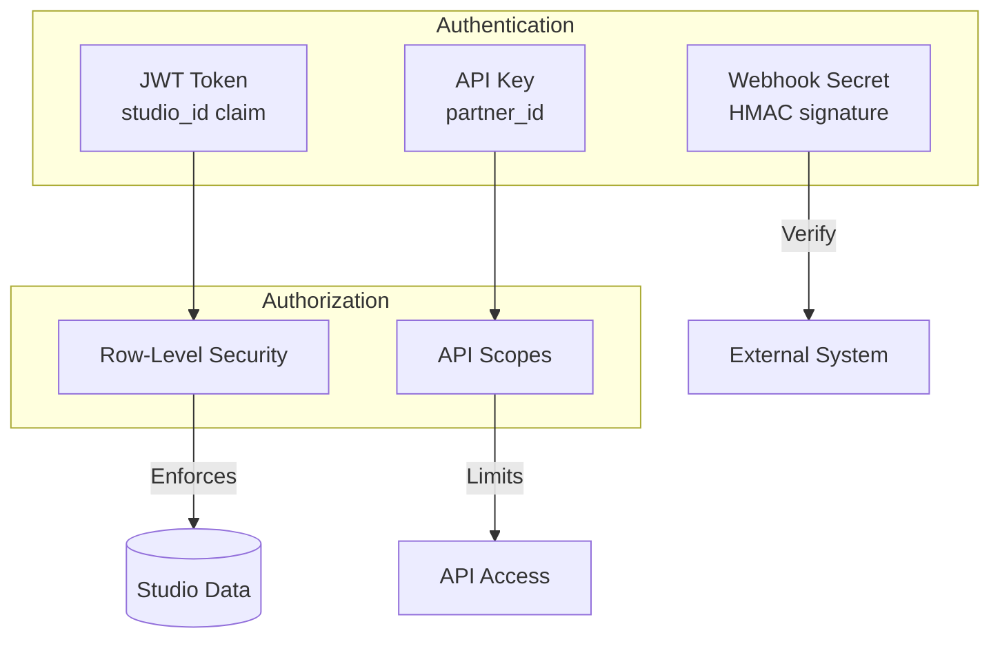

# Integrations

How external systems connect to Tandava.

---

## Integration Philosophy

```
┌─────────────────────────────────────────────────────────────┐
│  The core system is complete without integrations.          │
│  Integrations extend; they do not enable.                   │
│  Data flows outward by default. Inward flow is explicit.    │
└─────────────────────────────────────────────────────────────┘
```

**Principles:**
- **Export-first** — Studios can always extract their data
- **User-authorized** — No integration accesses data without studio consent
- **Additive** — Integrations annotate; they don't fork reality
- **Channel-aware** — External bookings are tracked by source

---

## Integration Architecture



---

## Integration Categories

### 1. Export Integrations (Outbound, Pull)

Studio pulls data out for use elsewhere.



**Available exports:**
- Daily sales summary
- Detailed transactions
- Teacher payroll
- Stripe reconciliation
- Member directory
- Attendance reports

### 2. Webhook Integrations (Outbound, Push)

System pushes events to external endpoints.



**Available events:**
| Event | Trigger |
|-------|---------|
| `booking.created` | New booking |
| `booking.cancelled` | Booking cancelled |
| `checkin.completed` | Student checked in |
| `sale.created` | Purchase completed |
| `sale.refunded` | Refund processed |
| `membership.created` | New membership |
| `membership.cancelled` | Membership cancelled |
| `class.cancelled` | Class cancelled by studio |

### 3. Partner API (Inbound)

External systems create bookings in Tandava.



**Key rules:**
- Partner provides API credentials
- Bookings tagged with `channel` and `source_ref`
- Same capacity checks as direct bookings
- Appears on same roster

### 4. Payment Integration (Bidirectional)



### 5. Calendar Sync (Bidirectional)



- Read-only iCal feed for teachers and students
- Subscribe URL per user
- Updates automatically

---

## Integration Evolution



**Current status:**
- ✅ Phase 1: Export-First (implemented)
- 🔄 Phase 2: Automation (in progress)
- 📋 Phase 3: APIs (planned)
- 📋 Phase 4: Native (future)

---

## Channel Attribution

When bookings come from external sources, they're tracked:



**Exports include:**
- `booking.channel` — How the booking was created
- `booking.source_ref` — External system's ID
- `booking.source_metadata` — Additional context

---

## Security Model



- **Web app:** JWT with studio_id, enforced by RLS
- **Partner API:** API key with defined scopes
- **Webhooks:** HMAC signature verification

---

## Related Documentation

- [WORKFLOW_AUTOMATION.md](../guides/WORKFLOW_AUTOMATION.md) — Zapier/Make setup
- [BUSINESS_CONNECTORS.md](../ai-agents/BUSINESS_CONNECTORS.md) — Export specifications
- [PRD-016](../prd/PRD-016-accounting-exports.md) — Accounting exports PRD
