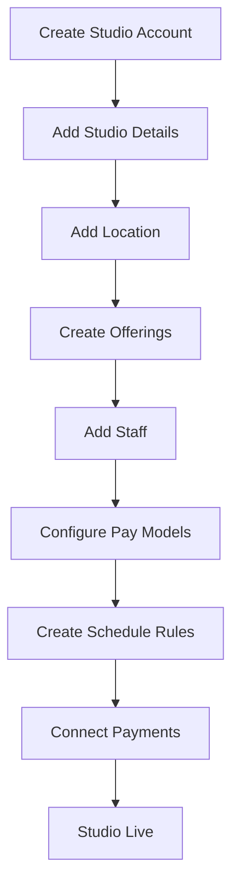
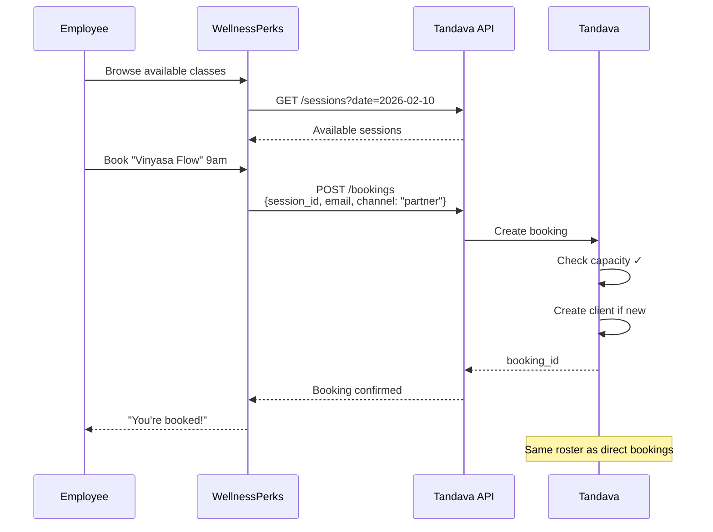
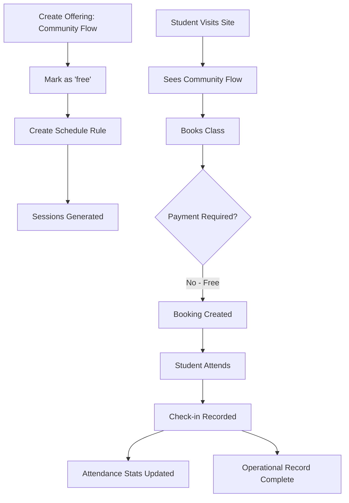
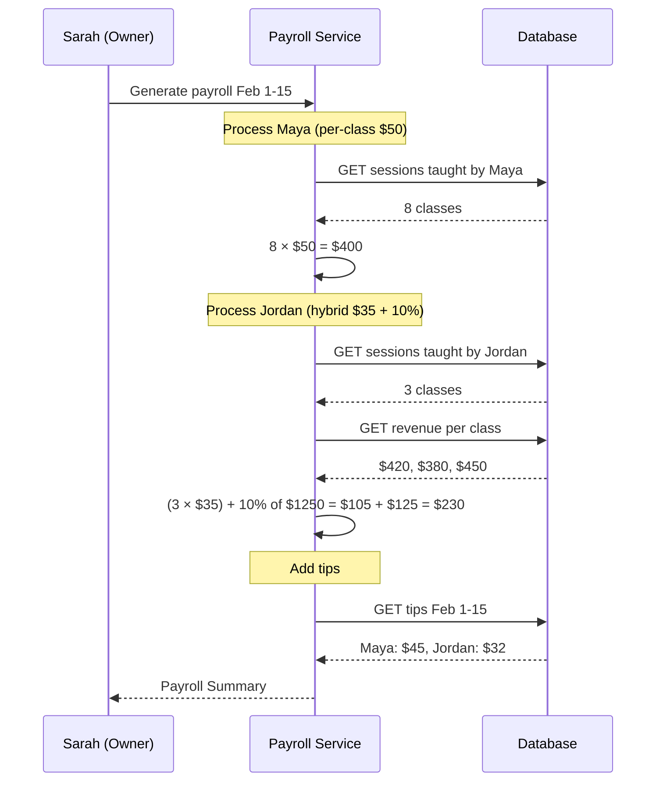
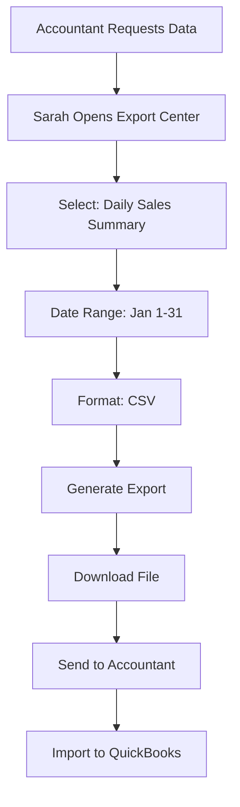
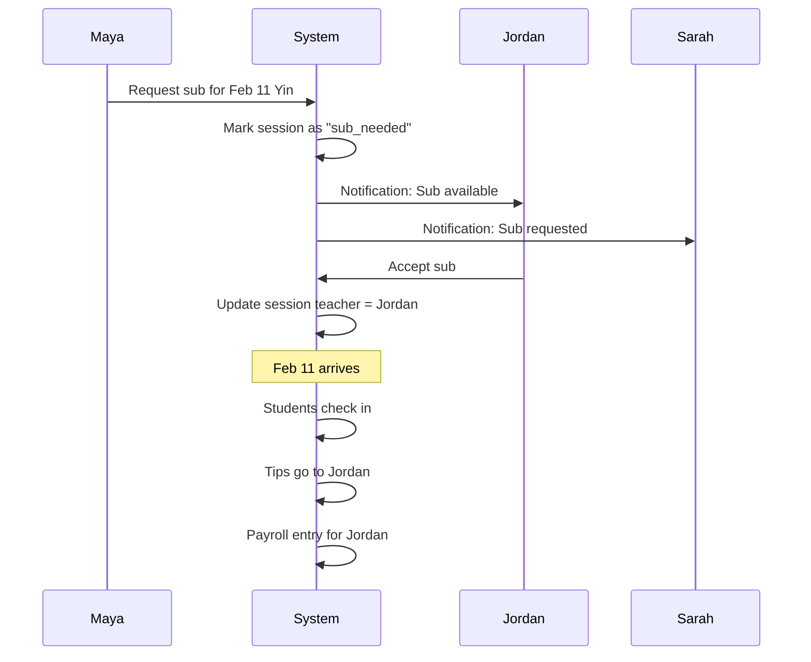
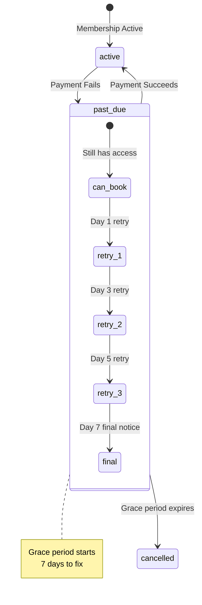

# Scenarios

End-to-end walkthroughs anchoring concepts in realistic situations.

---

## Scenario 1: New Studio Setup

**Story:** Sarah opens "Sunrise Yoga" in Austin. She needs to configure the system from scratch.

### Flow



### Key Steps

1. **Create Studio**
   - Name: "Sunrise Yoga"
   - Timezone: America/Chicago
   - Sarah becomes owner role

2. **Add Location**
   - "Downtown Studio"
   - 1234 Congress Ave, Austin TX
   - 2 rooms: Main (30 capacity), Small (12 capacity)

3. **Create Offerings**
   - "Vinyasa Flow" (60 min, all levels)
   - "Yin Yoga" (75 min, beginner)
   - "Hot Power" (60 min, intermediate)

4. **Add Staff**
   - Sarah (owner, also teaches)
   - Maya (teacher, per-class $50)
   - Jordan (teacher, hybrid $35 + 10%)

5. **Create Schedule Rules**
   - Vinyasa: Mon/Wed/Fri 9am, Sarah teaches
   - Yin: Tue/Thu 7pm, Maya teaches
   - Hot Power: Sat 10am, Jordan teaches

6. **Connect Stripe**
   - Stripe Connect onboarding
   - Bank account linked

**Concepts exercised:**
- Studio → Location → Offering hierarchy
- Schedule Rule → Session generation
- Staff with different pay models

---

## Scenario 2: Partner Booking Integration

**Story:** Sunrise Yoga partners with "WellnessPerks," a corporate wellness platform. Employees can book through WellnessPerks and attend at Sunrise.

### Flow



### Configuration

1. **Create Partner Account**
   - Partner: "WellnessPerks"
   - API key generated
   - Scopes: `bookings:create`, `sessions:read`

2. **Map Entitlements**
   - WellnessPerks handles payment
   - Bookings tagged: `channel: "partner"`, `source_ref: "wp_12345"`

3. **Reporting**
   - Monthly export: bookings where channel = "partner"
   - Invoice WellnessPerks based on attendance

**Concepts exercised:**
- Channel as metadata (not separate system)
- Partner API authentication
- External entitlement (partner handles payment)

---

## Scenario 3: Zero-Payment Booking

**Story:** Sarah wants to offer a free community class on Sunday mornings. No payment required, but attendance must be tracked.

### Flow



### Configuration

1. **Create Free Offering**
   - "Community Flow"
   - Price: $0
   - Entitlement required: None

2. **Booking Behavior**
   - No payment collection
   - No entitlement deduction
   - Booking still created and tracked

3. **Why This Works**
   - Bookings are operational facts, not financial instruments
   - Sessions happen regardless of payment
   - Attendance is recorded the same way

**Concepts exercised:**
- Operations before monetization
- Booking ≠ Transaction
- Session exists independently of revenue

---

## Scenario 4: Teacher Pay Period

**Story:** It's February 15th. Sarah needs to calculate pay for Maya and Jordan for the first half of February.

### Flow



### Output

| Teacher | Classes | Base Pay | Revenue Share | Tips | Total |
|---------|---------|----------|---------------|------|-------|
| Maya | 8 | $400 | — | $45 | $445 |
| Jordan | 3 | $105 | $125 | $32 | $262 |

### Export for Bookkeeper

```csv
Teacher,Period,Classes,Hours,Base Pay,Revenue Share,Tips,Total
Maya Patel,Feb 1-15,8,10.0,400.00,0.00,45.00,445.00
Jordan Lee,Feb 1-15,3,3.75,105.00,125.00,32.00,262.00
```

**Concepts exercised:**
- Multiple pay models
- Tips separate from base pay
- Export for external payroll

---

## Scenario 5: Data Export for Accountant

**Story:** Sarah's accountant needs January financial data for tax preparation.

### Flow



### Export Contents

```csv
Date,Location,Category,Gross,Discounts,Net,Tax,Refunds,Revenue
2026-01-01,Downtown,Memberships,2850.00,150.00,2700.00,0.00,0.00,2700.00
2026-01-01,Downtown,Class Packs,1200.00,0.00,1200.00,0.00,50.00,1150.00
2026-01-01,Downtown,Drop-In,450.00,0.00,450.00,0.00,0.00,450.00
2026-01-02,Downtown,Memberships,1425.00,0.00,1425.00,0.00,0.00,1425.00
...
```

### Why This Format

- Pre-aggregated by date + location + category
- Matches QuickBooks import expectations
- Reference numbers for reconciliation
- Refunds shown separately
- Tax collected (for taxable jurisdictions)

**Concepts exercised:**
- Export as first-class interface
- Structured, reconcilable data
- Channel/source aware

---

## Scenario 6: Handling a Substitution

**Story:** Maya can't teach Tuesday's Yin class. Jordan will sub.

### Flow



### Key Points

- Session teacher updated, not duplicated
- Bookings unchanged (students still attending same session)
- Tips go to actual teacher (Jordan), not originally scheduled (Maya)
- Payroll reflects who actually taught

**Concepts exercised:**
- Session is mutable (teacher can change)
- Booking references session, not teacher
- One reality (no parallel session created)

---

## Scenario 7: Membership Grace Period

**Story:** A member's card fails on renewal. They still have access during grace period.

### Flow



### Behavior During Grace Period

| Day | Payment Status | Can Book? | System Action |
|-----|----------------|-----------|---------------|
| 0 | Failed | ✅ Yes | Email: "Payment failed, please update" |
| 1 | Retry failed | ✅ Yes | — |
| 3 | Retry failed | ✅ Yes | Email: "Second attempt failed" |
| 5 | Retry failed | ✅ Yes | Email: "Final warning" |
| 7 | Retry failed | ❌ No | Membership cancelled |

**Concepts exercised:**
- Entitlement ≠ Payment
- Membership status separate from transaction status
- Operations continue during payment issues

---

## Quick Reference: Concepts by Scenario

| Scenario | Key Concepts |
|----------|--------------|
| New Studio Setup | Hierarchy, Schedule Rules, Pay Models |
| Partner Booking | Channel as Metadata, External Entitlements |
| Zero-Payment | Operations Before Monetization |
| Teacher Pay | Multiple Pay Models, Tips, Exports |
| Accountant Export | Export-First, Structured Data |
| Substitution | Session Mutability, One Reality |
| Grace Period | Entitlement ≠ Payment |

---

## Related Documentation

- [01-domain-model.md](01-domain-model.md) — Entity definitions
- [03-key-flows.md](03-key-flows.md) — Technical flows
- [COMPENSATION_GUIDE.md](../guides/COMPENSATION_GUIDE.md) — Pay model details
